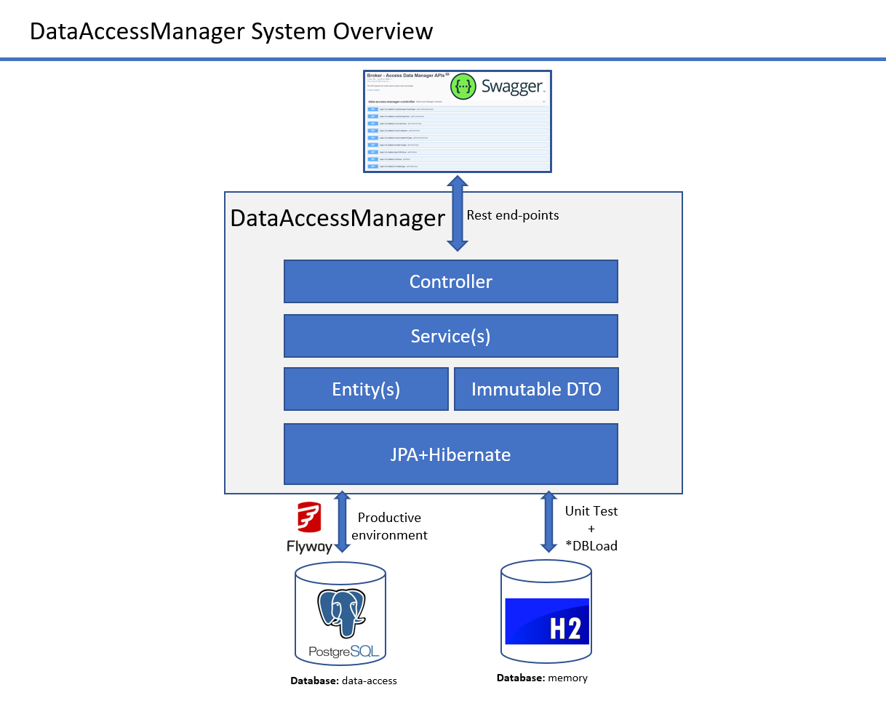
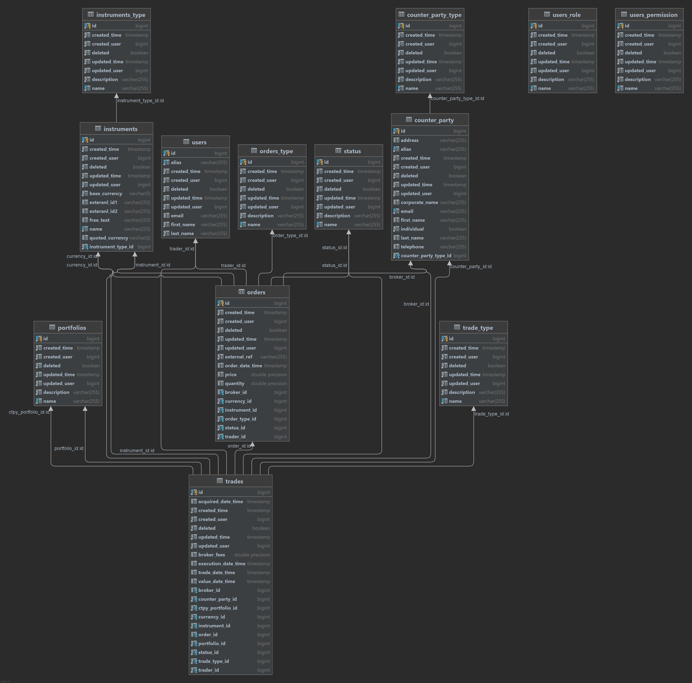
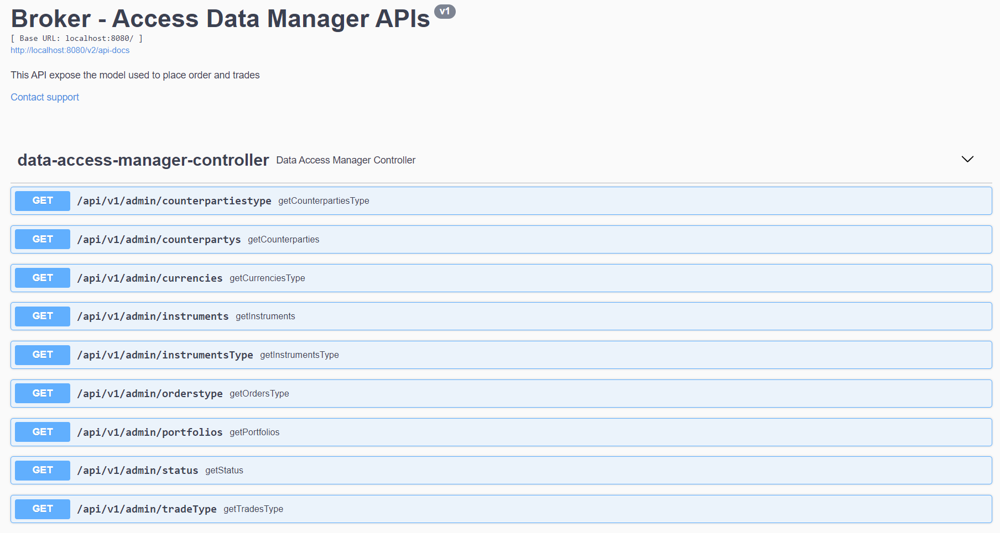

= Broker-data-access

== New features from branch "flyway":

* Added flyway database for versioning
- To create tables
- To create basic initial load for semi-static configuration tables
* Added Unittest
- Added H2 for unit test
- Added integration testing for the controller
* Files *DBLoad
- Refactoring moving *DBLoad into *.database.config package
- Excluded in @SpringBootApplication
- Right now only used during Unittest

== DataAccessManager API Project Description:

* DataAccessManager API is designed to expose the relevant data to enable the system to place orders and trades
* This API exposes semi-static data
* A set of endpoint are offered by the API to fetch the data, for more details go to swagger section
* Order and trade, both are going to be parallel services to allow the system scale horizontally

=== Data Model

* Database name: data-access

* IMPORTANT: The Data Model is still under definition

== Project

=== Building

* Go to <WORKSPACE>/

* To launch the tests:

    mvn clean test

* To package the application:

    mvn clean package

* To run/stop the application:

    mvn spring-boot:run
    mvn spring-boot:stop

* To build a new docker image:

    mvn spring-boot:build-image

IMPORTANT: If you run the service locally, you have to deploy PostgreSql first, for more details go to dockers section.

== Spring Boot

* Spring Boot Web
* Spring Boot Jpa
* Spring Boot Actuator

=== Spring Boot Help

* https://spring.io/projects/spring-boot[Spring Boot]

== API definition

The definition can be accessed via swagger-ui, to access to it go to:

    http://localhost:9081/swagger-ui/#

=== Swagger help

* https://swagger.io/[Swagger.io]

== Storage

* Uses PostgreSql to store the model defined

IMPORTANT:

* The database is still until design
* Added flyway for control versioning

== Docker-compose

=== Building

To deploy only PostgreSql

* Go to <WORKSPACE>/docker-compose/postgresql
* execute

    docker-compose up -d

=== Docker Help

* https://docs.docker.com/[Docker.com]